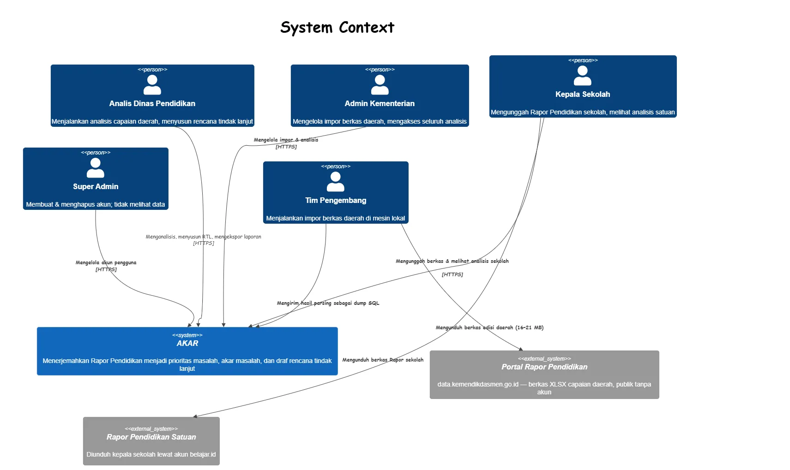
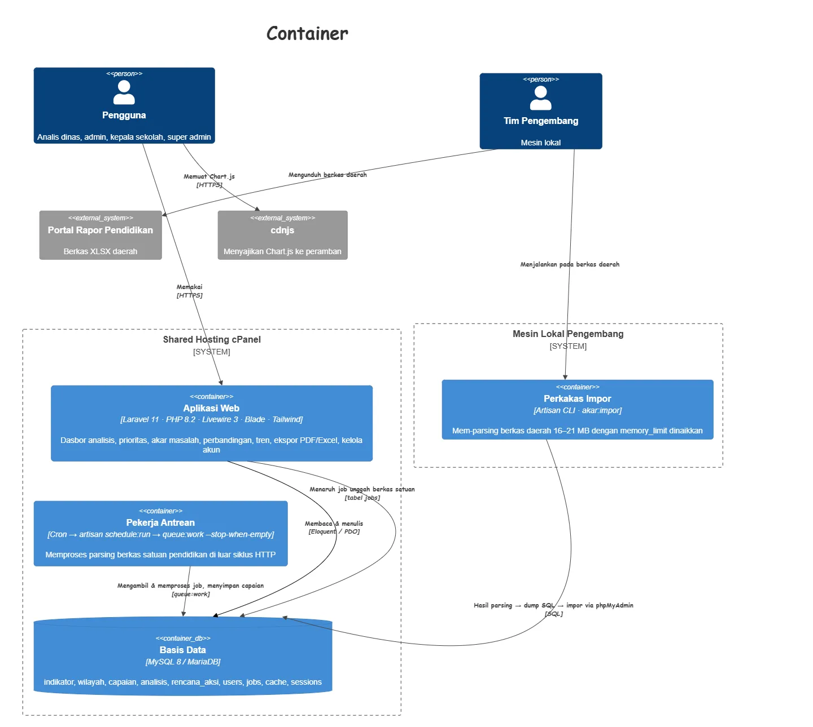
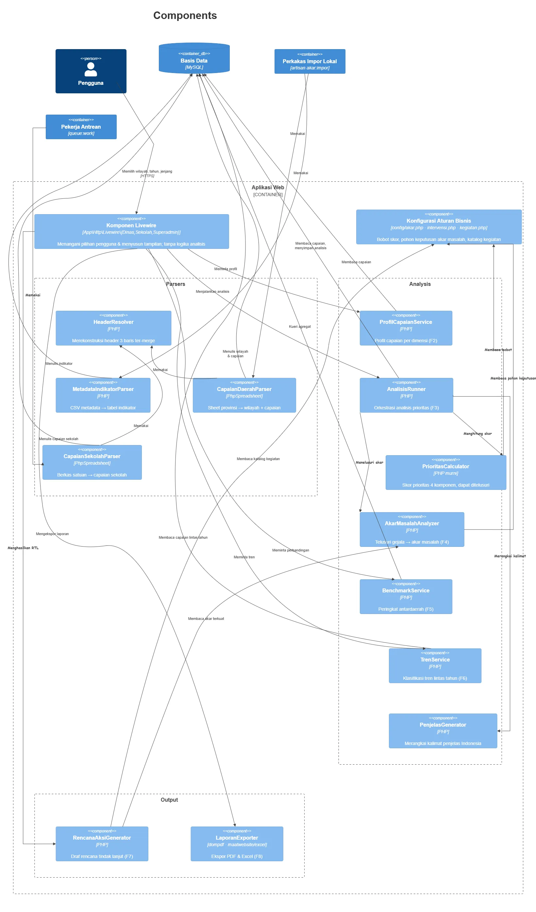

# AKAR — Analisis Kausal dan Rekomendasi

Rapor Pendidikan memberi tahu bahwa nilainya merah. **AKAR** memberi tahu apa yang
harus dilakukan Senin pagi.

AKAR membaca berkas Rapor Pendidikan terbitan Kemendikdasmen, menemukan indikator
berlabel merah, menelusuri akar masalahnya lewat pohon keputusan yang eksplisit,
lalu menghasilkan draf rencana tindak lanjut yang siap dibawa ke rapat perencanaan.

Dibangun untuk **HoloDev — HOLOGY 9.0** Universitas Brawijaya, subtema Pendidikan,
oleh **Tim EsTehPlastik**.

---

## Dua level pengguna, satu logika analisis

| Level | Pengguna | Sumber berkas |
|---|---|---|
| **Kabupaten/kota** | Dinas Pendidikan | Rapor Pendidikan Indonesia — publik, tanpa akun |
| **Satuan pendidikan** | Kepala sekolah & tim | Rapor Pendidikan sekolah — dari akun belajar.id |

Yang membedakan hanya berkas masukannya. Parser, mesin analisis, dan generator
rencana aksi identik untuk keduanya. Dinas melihat seluruh kabupatennya; kepala
sekolah melihat sekolahnya sendiri, dibandingkan terhadap agregat kabupaten induk.

Ada juga peran **Super Admin** yang tugasnya hanya membuat/menghapus akun dan
**tidak dapat melihat data apa pun**.

---

## Fitur

| Kode | Fitur |
|---|---|
| F1 | Impor & parsing berkas Rapor Pendidikan (header bertingkat, sel ter-merge) |
| F2 | Profil capaian daerah/sekolah per dimensi, dengan ambang resmi |
| F3 | Deteksi & prioritisasi masalah — skor 4 komponen yang dapat ditelusuri |
| F4 | Analisis akar masalah lewat pohon keputusan di `config/`, dengan tingkat keyakinan |
| F5 | Perbandingan antardaerah (peringkat + pembanding provinsi/nasional) |
| F6 | Analisis tren lintas tahun (memburuk berturut / membaik konsisten) |
| F7 | Generator rencana tindak lanjut (kegiatan, penanggung jawab, indikator keberhasilan) |
| F8 | Ekspor laporan PDF & Excel |
| F9 | Autentikasi & peran |
| F10 | Mode satuan pendidikan (unggah berkas sekolah) |

**Tidak ada machine learning atau panggilan API LLM di jalur analisis.** Keluaran
sistem dipakai untuk perencanaan anggaran publik, jadi setiap angka dan
rekomendasi harus dapat dijelaskan sepenuhnya. Indikator yang belum dipetakan
akar masalahnya ditampilkan apa adanya — sistem tidak mengarang rekomendasi.

---

## Arsitektur

### C1 — Konteks sistem



### C2 — Kontainer



### C3 — Komponen mesin analisis



> Sumber diagram (Mermaid C4) ada di `c4.md`. Uraian lengkap di `ARCHITECTURE.md`.

### Keputusan arsitektur yang menentukan

**Pemisahan proses impor dari proses penyajian.** Berkas Rapor Pendidikan daerah
berukuran 16–21 MB dengan header tiga baris bersel-merge. Mem-parsing-nya butuh
memori besar dan waktu lama — tidak cocok untuk shared hosting. Karena itu:

- Berkas daerah **diparse di mesin lokal** lewat `php artisan akar:impor`,
  hasilnya dikirim ke produksi sebagai dump SQL.
- Server produksi **hanya menyajikan analisis**. Fitur unggah di produksi
  diperuntukkan bagi berkas satuan pendidikan yang jauh lebih kecil, dan
  diproses lewat antrean, bukan di dalam siklus request HTTP.

**Batasan cPanel yang dipatuhi sejak awal:** tidak ada Redis (cache/session/queue
pakai driver `database`), tidak ada worker daemon (antrean lewat cron
`schedule:run` + `queue:work --stop-when-empty`), tidak ada Node.js di server
(aset dibangun di lokal, `public/build` ikut di-commit), memori & waktu eksekusi
PHP terbatas.

**Aturan bisnis ada di `config/`, bukan di kode.** Bobot skor prioritas
(`config/akar.php`), pohon keputusan akar masalah (`config/intervensi.php`), dan
katalog kegiatan (`config/kegiatan.php`) semuanya berupa konfigurasi. Bila
indikator atau ambang berubah tahun depan, cukup ubah berkas konfigurasi.

**Setiap skor dapat ditelusuri.** `PrioritasCalculator` mengembalikan skor
beserta rincian tiap komponennya (label, arah perubahan, posisi relatif, dampak
ke indikator turunan), disimpan di kolom JSON.

### Tumpukan teknologi

```
Laravel 13 · PHP 8.3
Blade + Livewire 4          seluruh bagian interaktif
Tailwind CSS 4 · Vite 8     aset dibangun di lokal
MySQL 8 / MariaDB           BUKAN PostgreSQL (batasan cPanel)
PhpSpreadsheet              parsing XLSX (via maatwebsite/excel)
spatie/laravel-permission   peran & izin
barryvdh/laravel-dompdf     ekspor PDF
Chart.js (CDN cdnjs)        grafik
```

Dependensi sengaja dijaga minimal — tiap paket tambahan adalah risiko di
lingkungan cPanel.

---

## Struktur kode

```
app/
├── Console/Commands/ImporRaporCommand.php   artisan akar:impor {path}
├── Http/Livewire/
│   ├── Dinas/          komponen level daerah
│   ├── Sekolah/        komponen level satuan pendidikan
│   └── Superadmin/     kelola akun
├── Jobs/               pemrosesan impor berkas satuan (antrean)
└── Services/Akar/
    ├── Parsers/        HeaderResolver, MetadataIndikatorParser,
    │                   CapaianDaerahParser, CapaianSekolahParser
    ├── Analysis/       PrioritasCalculator, AnalisisRunner, AkarMasalahAnalyzer,
    │                   BenchmarkService, TrenService, ProfilCapaianService,
    │                   PenjelasGenerator
    └── Output/         RencanaAksiGenerator, LaporanExporter
config/
├── akar.php            bobot skor prioritas
├── intervensi.php      pohon keputusan akar masalah
└── kegiatan.php        katalog kegiatan
```

Controller dan komponen Livewire **tidak berisi logika analisis** — semua
perhitungan ada di `app/Services/Akar/`. Setiap parser punya test dengan berkas
fixture kecil; parser adalah komponen paling berisiko di proyek ini.

---

## Menjalankan secara lokal

Prasyarat: PHP 8.3, Composer, Node.js.

```bash
composer install
npm install
cp .env.example .env
php artisan key:generate
npm run build
```

Basis data mengikuti `DB_CONNECTION` di `.env`. Untuk pengembangan cepat, SQLite
sudah cukup (`DB_CONNECTION=sqlite`, `touch database/database.sqlite`). Produksi
memakai MySQL.

### Basis data siap-demo

Satu perintah menyiapkan skema, peran, akun demo, indikator, dan satu provinsi
contoh (bila folder `dataset/` tersedia):

```bash
php artisan akar:demo --fresh
php artisan serve
```

### Mengisi data Rapor Pendidikan secara manual

Impor dilakukan di mesin lokal, bukan di server produksi (lihat `ARCHITECTURE.md`
bagian 4). Berkas Metadata indikator wajib diimpor lebih dulu.

```bash
php artisan akar:impor path/METADATA_INDIKATOR_RAPOR_PENDIDIKAN.csv
php artisan akar:impor path/data-rapor-pendidikan-indonesia.xlsx
```

---

## Akun demo

Dibuat otomatis oleh `php artisan migrate:fresh --seed`. Kata sandi ketiganya
`password`.

| Peran | Email | Bisa melakukan |
|---|---|---|
| Administrator | `admin@akar.test` | Impor berkas daerah, seluruh analisis dan rencana |
| Analis Dinas | `analis@akar.test` | Menjalankan analisis, menyusun rencana tindak lanjut |
| Kepala Sekolah | `kepala@akar.test` | Mengunggah berkas satuan pendidikan, analisis, rencana |

Akun **Super Admin** (hanya membuat/menghapus akun, tidak melihat data) tidak
ikut sebagai akun demo. Kredensialnya diatur lewat `.env`:

```
SUPERADMIN_NAMA="Nama Pengelola"
SUPERADMIN_EMAIL=pengelola@instansi.go.id
SUPERADMIN_PASSWORD=kata-sandi-kuat
```

Akun ini dibuat oleh seeder bila kedua nilai di atas terisi.

---

## Pengujian

```bash
php artisan test
```

Unit test memakai berkas fixture kecil; verifikasi akhir memakai berkas Rapor
Pendidikan sungguhan.

---

## Dokumen rujukan

| Berkas | Isi |
|---|---|
| `PRD.md` | Kebutuhan produk, ruang lingkup, jadwal |
| `ARCHITECTURE.md` | Arsitektur teknis, struktur berkas sumber, skema basis data |
| `DESIGN.md` | Sistem visual — warna, tipografi, komponen |
| `PANDUAN-PENGEMBANGAN.md` | Aturan kerja & konvensi kode |

---

## Tim

Dikerjakan oleh **Tim EsTehPlastik** untuk HoloDev HOLOGY 9.0 Universitas
Brawijaya, subtema Pendidikan.
